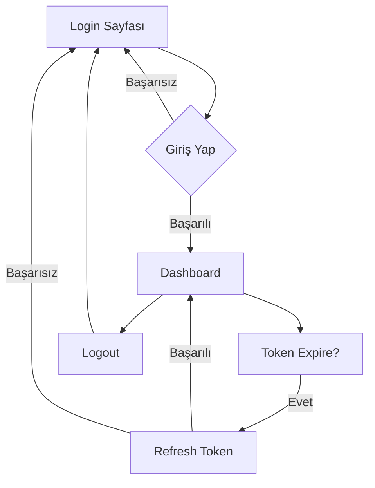
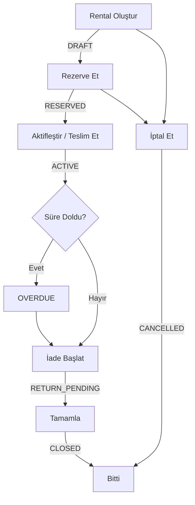
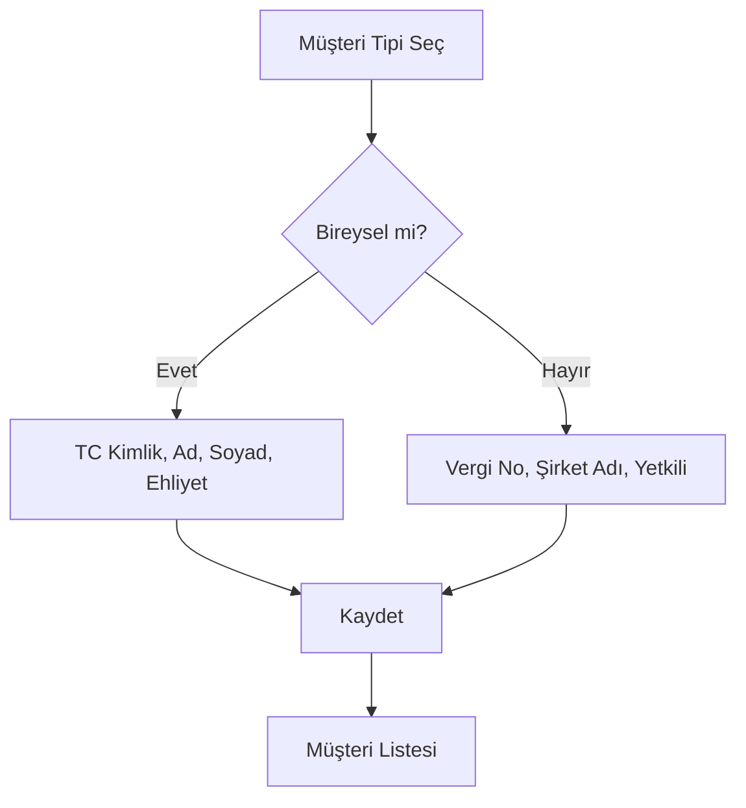
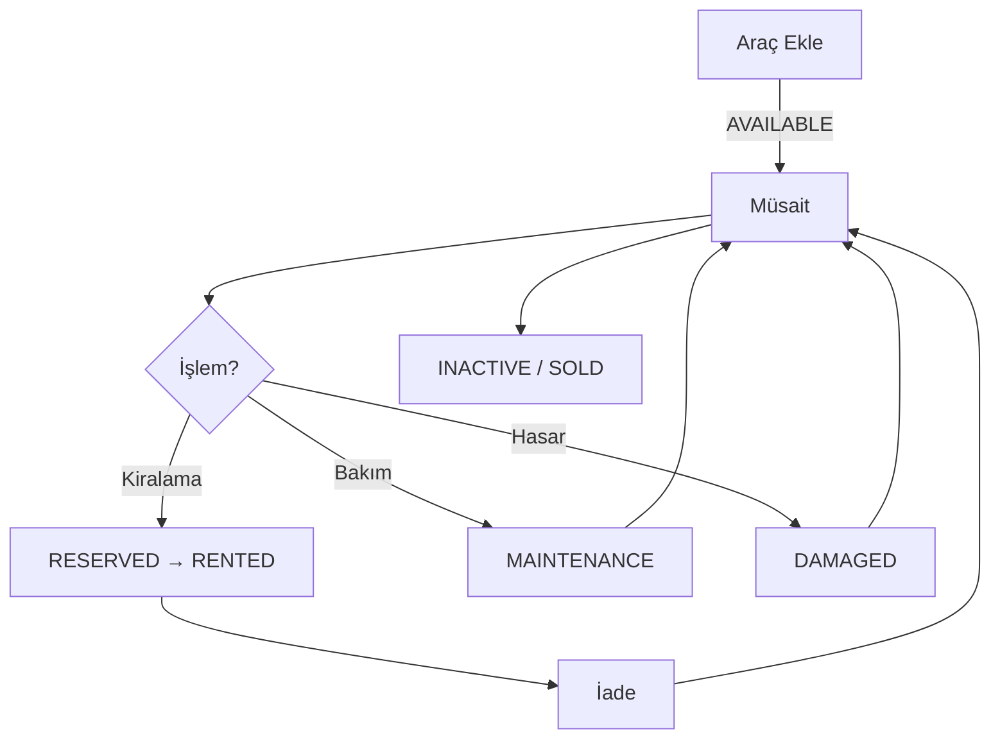
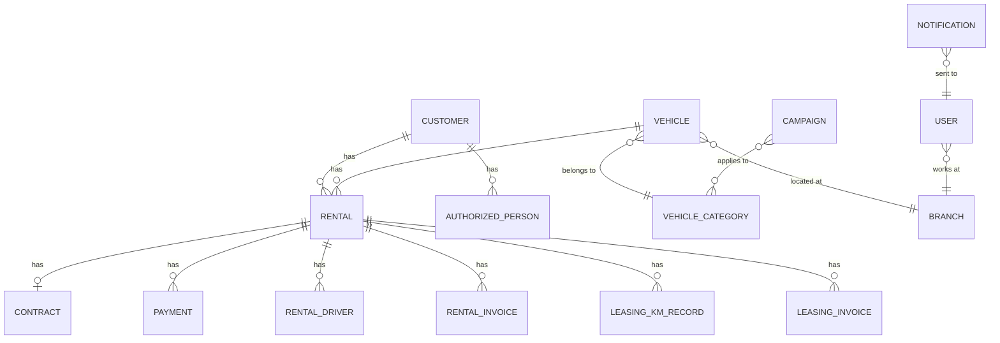

# Reindecar Frontend Development Guide

Bu döküman, Reindecar araç kiralama sistemi için frontend geliştirme sürecinde ihtiyaç duyulacak tüm API'leri, entity'leri, kullanıcı akışlarını ve veri yapılarını içermektedir.

---

## 1. API Genel Yapısı

### Base URL
```
/api/v1
```

### Response Wrapper
Tüm API yanıtları aşağıdaki yapıda döner:

```json
{
  "success": true,
  "message": "Optional message",
  "data": { ... },
  "timestamp": "2026-01-19T12:00:00Z"
}
```

### Pagination Response
Sayfalanmış yanıtlar için:

```json
{
  "content": [...],
  "page": 0,
  "size": 20,
  "totalElements": 100,
  "totalPages": 5,
  "first": true,
  "last": false
}
```

### Authentication
- JWT Bearer Token kullanılır
- Header: `Authorization: Bearer <token>`
- Token refresh: `/api/v1/auth/refresh`

---

## 2. Kullanıcı Akışları (User Flows)

### 2.1 Authentication Flow



### 2.2 Rental Lifecycle Flow (Ana İş Akışı)



### 2.3 Customer Registration Flow



### 2.4 Vehicle Management Flow



---

## 3. API Endpoints Referansı

### 3.1 Authentication (`/api/v1/auth`)

| Method | Endpoint | Açıklama | Auth |
|--------|----------|----------|------|
| POST | `/login` | Kullanıcı girişi | ❌ |
| POST | `/refresh` | Token yenileme | ❌ |
| POST | `/logout` | Çıkış | ✅ |
| GET | `/me` | Mevcut kullanıcı bilgisi | ✅ |

### 3.2 Users (`/api/v1/users`)

| Method | Endpoint | Açıklama | Auth | Role |
|--------|----------|----------|------|------|
| GET | `/` | Tüm kullanıcılar (paginated) | ✅ | ADMIN |
| GET | `/{id}` | Kullanıcı detayı | ✅ | - |
| POST | `/` | Yeni kullanıcı | ✅ | ADMIN |
| PUT | `/{id}` | Kullanıcı güncelle | ✅ | ADMIN |
| PATCH | `/{id}/status` | Durum değiştir | ✅ | ADMIN |
| PATCH | `/{id}/password` | Şifre değiştir | ✅ | - |
| DELETE | `/{id}` | Kullanıcı sil | ✅ | ADMIN |

### 3.3 Customers (`/api/v1/customers`)

| Method | Endpoint | Açıklama | Auth |
|--------|----------|----------|------|
| GET | `/` | Tüm müşteriler (paginated) | ✅ |
| GET | `/type/{type}` | Tipe göre müşteriler | ✅ |
| GET | `/blacklisted` | Kara listedeki müşteriler | ✅ |
| GET | `/{id}` | Müşteri detayı | ✅ |
| GET | `/public/{publicId}` | UUID ile müşteri | ✅ |
| POST | `/personal` | Bireysel müşteri oluştur | ✅ |
| POST | `/company` | Kurumsal müşteri oluştur | ✅ |
| PATCH | `/{id}/blacklist` | Kara listeye ekle | ✅ |
| PATCH | `/{id}/unblacklist` | Kara listeden çıkar | ✅ |
| DELETE | `/{id}` | Müşteri sil (soft) | ✅ |

### 3.4 Vehicles (`/api/v1/vehicles`)

| Method | Endpoint | Açıklama | Auth |
|--------|----------|----------|------|
| GET | `/` | Tüm araçlar (paginated) | ✅ |
| GET | `/available` | Müsait araçlar | ✅ |
| GET | `/branch/{branchId}` | Şubeye göre araçlar | ✅ |
| GET | `/{id}` | Araç detayı | ✅ |
| POST | `/` | Araç oluştur | ✅ |
| PATCH | `/{id}/status` | Durum değiştir | ✅ |
| PATCH | `/{id}/branch` | Şube değiştir | ✅ |
| PATCH | `/{id}/km` | Kilometre güncelle | ✅ |
| DELETE | `/{id}` | Araç sil (soft) | ✅ |
| GET | `/{id}/history` | Durum geçmişi | ✅ |
| GET | `/{id}/details` | Detaylı bilgiler | ✅ |
| PUT | `/{id}/details` | Detayları güncelle | ✅ |

### 3.5 Vehicle Categories (`/api/v1/vehicle-categories`)

| Method | Endpoint | Açıklama | Auth |
|--------|----------|----------|------|
| GET | `/` | Aktif kategoriler | ✅ |
| GET | `/{id}` | Kategori detayı | ✅ |
| POST | `/` | Kategori oluştur | ✅ |
| DELETE | `/{id}` | Kategori sil | ✅ |

### 3.6 Branches (`/api/v1/branches`)

| Method | Endpoint | Açıklama | Auth |
|--------|----------|----------|------|
| GET | `/` | Tüm şubeler (paginated) | ✅ |
| GET | `/active` | Aktif şubeler | ✅ |
| GET | `/{id}` | Şube detayı | ✅ |
| POST | `/` | Şube oluştur | ✅ |
| PUT | `/{id}` | Şube güncelle | ✅ |
| PATCH | `/{id}/status` | Durum değiştir | ✅ |
| DELETE | `/{id}` | Şube sil (soft) | ✅ |

### 3.7 Rentals (`/api/v1/rentals`) - CORE DOMAIN

| Method | Endpoint | Açıklama | Auth |
|--------|----------|----------|------|
| GET | `/` | Tüm kiralamalar (paginated) | ✅ |
| GET | `/active` | Aktif kiralamalar | ✅ |
| GET | `/overdue` | Gecikmiş kiralamalar | ✅ |
| GET | `/{id}` | Kiralama detayı | ✅ |
| POST | `/` | Kiralama oluştur (DRAFT) | ✅ |
| POST | `/{id}/reserve` | Rezerve et | ✅ |
| POST | `/{id}/activate` | Aktifleştir (teslim) | ✅ |
| POST | `/{id}/start-return` | İade başlat | ✅ |
| POST | `/{id}/complete` | Tamamla | ✅ |
| POST | `/{id}/cancel` | İptal et | ✅ |

### 3.8 Contracts (`/api/v1/contracts`)

| Method | Endpoint | Açıklama | Auth |
|--------|----------|----------|------|
| GET | `/{id}` | Sözleşme detayı | ✅ |
| GET | `/rental/{rentalId}` | Kiralamaya ait sözleşme | ✅ |
| POST | `/` | Sözleşme oluştur | ✅ |
| POST | `/{id}/sign` | Sözleşme imzala | ✅ |
| POST | `/{id}/cancel` | Sözleşme iptal | ✅ |

### 3.9 Payments (`/api/v1/payments`)

| Method | Endpoint | Açıklama | Auth |
|--------|----------|----------|------|
| GET | `/` | Tüm ödemeler (paginated) | ✅ |
| GET | `/rental/{rentalId}` | Kiralamaya ait ödemeler | ✅ |
| POST | `/rental/{rentalId}` | Ödeme kaydet | ✅ |

### 3.10 Pricing (`/api/v1/pricing`)

| Method | Endpoint | Açıklama | Auth |
|--------|----------|----------|------|
| POST | `/calculate` | Fiyat hesapla | ✅ |

### 3.11 Campaigns (`/api/v1/campaigns`)

| Method | Endpoint | Açıklama | Auth | Role |
|--------|----------|----------|------|------|
| GET | `/` | Tüm kampanyalar | ✅ | - |
| GET | `/active` | Aktif kampanyalar | ✅ | - |
| GET | `/active/today` | Bugün aktif kampanyalar | ✅ | - |
| GET | `/{id}` | Kampanya detayı | ✅ | - |
| POST | `/` | Kampanya oluştur | ✅ | ADMIN |
| POST | `/{id}/activate` | Kampanya aktifle | ✅ | ADMIN |
| POST | `/{id}/deactivate` | Kampanya deaktifle | ✅ | ADMIN |
| DELETE | `/{id}` | Kampanya sil | ✅ | ADMIN |

### 3.12 Seasons (`/api/v1/seasons`)

| Method | Endpoint | Açıklama | Auth |
|--------|----------|----------|------|
| GET | `/` | Tüm sezonlar | ✅ |
| GET | `/active` | Aktif sezonlar | ✅ |
| POST | `/` | Sezon oluştur | ✅ |
| PUT | `/{id}` | Sezon güncelle | ✅ |
| DELETE | `/{id}` | Sezon sil | ✅ |

### 3.13 Leasing KM Tracking (`/api/v1/leasing`)

| Method | Endpoint | Açıklama | Auth |
|--------|----------|----------|------|
| POST | `/{rentalId}/km-records` | KM kaydı ekle | ✅ |
| GET | `/{rentalId}/km-records` | KM geçmişi | ✅ |
| GET | `/{rentalId}/km-summary` | KM özeti | ✅ |

### 3.14 Leasing Invoices (`/api/v1/leasing-invoices`)

| Method | Endpoint | Açıklama | Auth | Role |
|--------|----------|----------|------|------|
| GET | `/{id}` | Fatura detayı | ✅ | - |
| GET | `/rental/{rentalId}` | Kiralamaya ait faturalar | ✅ | - |
| GET | `/customer/{customerId}` | Müşteriye ait faturalar | ✅ | - |
| POST | `/generate` | Fatura oluştur | ✅ | ADMIN |
| POST | `/{id}/send` | Fatura gönder | ✅ | ADMIN |
| POST | `/{id}/mark-paid` | Ödendi işaretle | ✅ | ADMIN |
| POST | `/{id}/cancel` | Fatura iptal | ✅ | ADMIN |

### 3.15 Notifications (`/api/v1/notifications`)

| Method | Endpoint | Açıklama | Auth |
|--------|----------|----------|------|
| GET | `/` | Bildirimler (paginated) | ✅ |
| GET | `/unread` | Okunmamış bildirimler | ✅ |
| GET | `/count` | Bildirim sayıları | ✅ |
| PATCH | `/{id}/read` | Okundu işaretle | ✅ |
| PATCH | `/{id}/dismiss` | Bildirim kapat | ✅ |
| POST | `/mark-all-read` | Tümünü okundu işaretle | ✅ |

### 3.16 Files (`/api/v1/files`)

| Method | Endpoint | Açıklama | Auth |
|--------|----------|----------|------|
| POST | `/upload` | Dosya yükle | ✅ |
| GET | `/{id}` | Dosya indir | ✅ |
| DELETE | `/{id}` | Dosya sil | ✅ |

---

## 4. Enums ve Sabit Değerler

### 4.1 Customer Types
```typescript
enum CustomerType {
  PERSONAL = "PERSONAL",  // Bireysel müşteri
  COMPANY = "COMPANY"     // Kurumsal müşteri
}
```

### 4.2 Customer Status
```typescript
enum CustomerStatus {
  ACTIVE = "ACTIVE",
  INACTIVE = "INACTIVE",
  BLACKLISTED = "BLACKLISTED"
}
```

### 4.3 Vehicle Status
```typescript
enum VehicleStatus {
  AVAILABLE = "AVAILABLE",     // Müsait
  RESERVED = "RESERVED",       // Rezerve edilmiş
  RENTED = "RENTED",           // Kiralanmış
  MAINTENANCE = "MAINTENANCE", // Bakımda
  DAMAGED = "DAMAGED",         // Hasarlı
  INACTIVE = "INACTIVE",       // Pasif
  SOLD = "SOLD"                // Satılmış
}
```

### 4.4 Rental Status
```typescript
enum RentalStatus {
  DRAFT = "DRAFT",               // Taslak
  RESERVED = "RESERVED",         // Rezerve
  ACTIVE = "ACTIVE",             // Aktif (araç teslim edilmiş)
  RETURN_PENDING = "RETURN_PENDING", // İade bekleniyor
  CLOSED = "CLOSED",             // Tamamlandı
  CANCELLED = "CANCELLED",       // İptal edildi
  OVERDUE = "OVERDUE"            // Gecikmiş
}
```

### 4.5 Rental Type
```typescript
enum RentalType {
  DAILY = "DAILY",       // Günlük kiralama
  WEEKLY = "WEEKLY",     // Haftalık kiralama
  MONTHLY = "MONTHLY",   // Aylık kiralama
  LEASING = "LEASING"    // Uzun dönem leasing
}
```

### 4.6 Payment Method
```typescript
enum PaymentMethod {
  CASH = "CASH",
  CREDIT_CARD = "CREDIT_CARD",
  DEBIT_CARD = "DEBIT_CARD",
  BANK_TRANSFER = "BANK_TRANSFER"
}
```

### 4.7 Payment Status
```typescript
enum PaymentStatus {
  PENDING = "PENDING",
  COMPLETED = "COMPLETED",
  FAILED = "FAILED",
  REFUNDED = "REFUNDED"
}
```

### 4.8 Fuel Type
```typescript
enum FuelType {
  GASOLINE = "GASOLINE",
  DIESEL = "DIESEL",
  ELECTRIC = "ELECTRIC",
  HYBRID = "HYBRID",
  LPG = "LPG"
}
```

### 4.9 Transmission
```typescript
enum Transmission {
  MANUAL = "MANUAL",
  AUTOMATIC = "AUTOMATIC"
}
```

### 4.10 User Role
```typescript
enum Role {
  ADMIN = "ADMIN",       // Tam yetkili
  OPERATOR = "OPERATOR"  // Operasyonel kullanıcı
}
```

### 4.11 Notification Priority
```typescript
enum NotificationPriority {
  LOW = "LOW",
  MEDIUM = "MEDIUM",
  HIGH = "HIGH",
  URGENT = "URGENT"
}
```

### 4.12 Credit Rating
```typescript
enum CreditRating {
  EXCELLENT = "EXCELLENT", // 1600-2000
  GOOD = "GOOD",           // 1200-1599
  FAIR = "FAIR",           // 800-1199
  POOR = "POOR",           // 400-799
  BAD = "BAD"              // 0-399
}
```

---

## 5. Entity İlişkileri



---

## 6. Frontend Sayfa Yapısı

### 6.1 Ana Sayfalar

| Sayfa | Route | Açıklama |
|-------|-------|----------|
| Dashboard | `/` | Özet istatistikler |
| Kiralamalar | `/rentals` | Kiralama listesi ve yönetimi |
| Araçlar | `/vehicles` | Araç listesi ve yönetimi |
| Müşteriler | `/customers` | Müşteri listesi ve yönetimi |
| Ödemeler | `/payments` | Ödeme listesi |
| Şubeler | `/branches` | Şube yönetimi |
| Kullanıcılar | `/users` | Kullanıcı yönetimi (ADMIN) |
| Ayarlar | `/settings` | Sistem ayarları |

### 6.2 Alt Sayfalar

| Sayfa | Route | Açıklama |
|-------|-------|----------|
| Kiralama Detay | `/rentals/:id` | Kiralama detayları |
| Yeni Kiralama | `/rentals/new` | Kiralama oluşturma |
| Araç Detay | `/vehicles/:id` | Araç detayları |
| Müşteri Detay | `/customers/:id` | Müşteri detayları |
| Kampanyalar | `/campaigns` | Kampanya yönetimi |
| Sezonlar | `/seasons` | Sezon fiyatlandırma |
| Leasing | `/leasing` | Leasing yönetimi |

---

## 7. State Management Önerileri

### 7.1 Global State
- `auth`: Kullanıcı kimlik bilgileri ve token
- `notifications`: Bildirim sayıları ve listesi
- `settings`: Uygulama ayarları

### 7.2 Sayfaya Özel State
- Her liste sayfası kendi pagination ve filter state'ini yönetmeli
- Form state'leri local olarak tutulmalı

### 7.3 Cache Stratejisi
- Statik veriler (kategoriler, şubeler) cache'lenebilir
- Dinamik veriler (kiralamalar, araçlar) her istek için yenilenmeli
- Token refresh otomatik yapılmalı

---

## 8. Error Handling

### Error Response Format
```json
{
  "success": false,
  "message": "Validation error",
  "data": {
    "errors": [
      {
        "field": "nationalId",
        "message": "Invalid Turkish National ID"
      }
    ]
  },
  "timestamp": "2026-01-19T10:00:00Z"
}
```

### HTTP Status Codes
| Code | Açıklama |
|------|----------|
| 200 | Başarılı |
| 201 | Oluşturuldu |
| 204 | İçerik yok (silme işlemleri) |
| 400 | Geçersiz istek / Validation hatası |
| 401 | Kimlik doğrulama gerekli |
| 403 | Yetki yok |
| 404 | Kaynak bulunamadı |
| 409 | Çakışma (duplicate veri) |
| 500 | Sunucu hatası |

---

## 9. Önemli Notlar

1. **Tüm tarihler UTC** olarak gelir, frontend'de local time'a çevrilmeli
2. **Para birimleri** `BigDecimal` olarak gelir, formatlanmalı
3. **Pagination** 0-indexed'dir (ilk sayfa = 0)
4. **Soft delete** kullanılır, silinen kayıtlar listede görünmez
5. **PII verileri** (TC Kimlik, telefon) maskelenmeli veya korunmalı
6. **Token expiry** 1 saat, refresh token ile yenilenmeli
